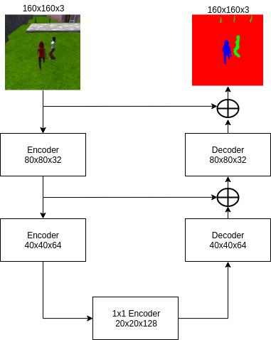
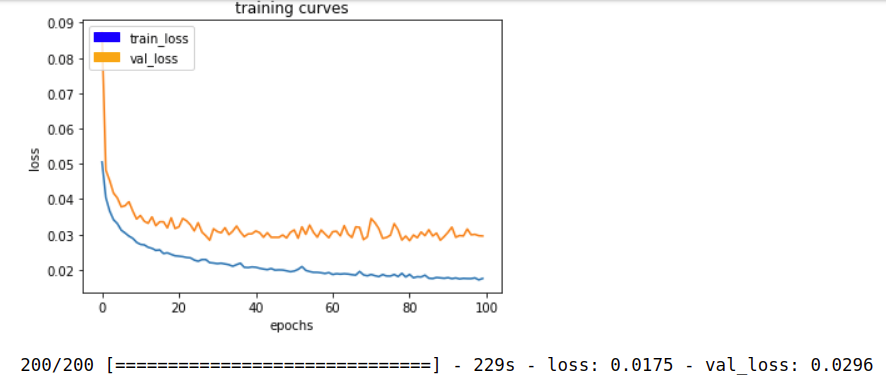
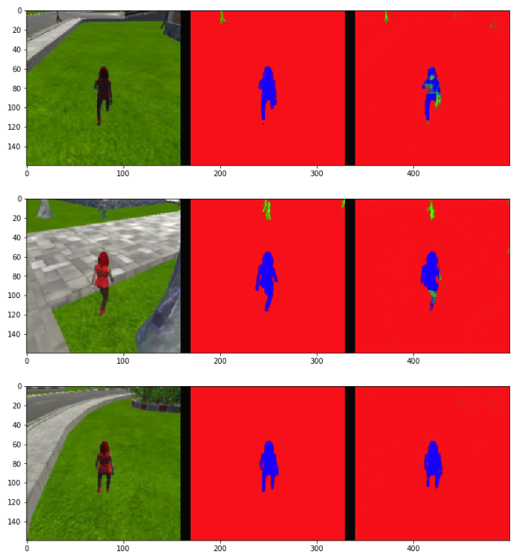
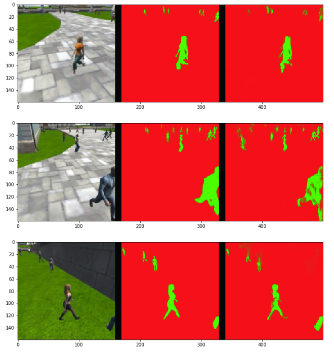
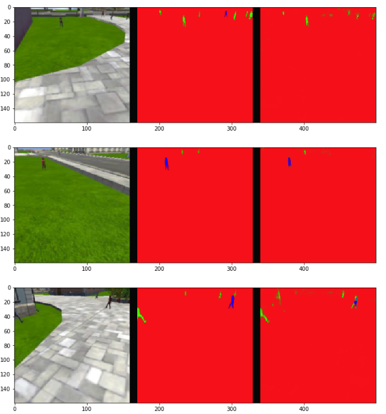
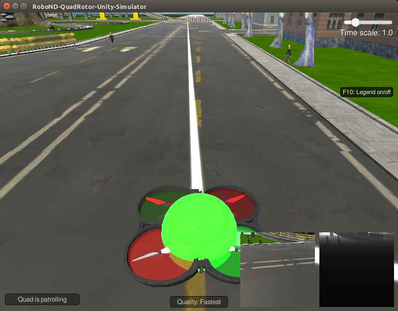

[](https://www.udacity.com/robotics)

## Deep Learning Project ##

In this project, you will train a deep neural network to identify and track a target in simulation. So-called “follow me” applications like this are key to many fields of robotics and the very same techniques you apply here could be extended to scenarios like advanced cruise control in autonomous vehicles or human-robot collaboration in industry.

[image_0]: ./docs/misc/sim_screenshot.png
![alt text][image_0] 

### Fully Convolutional Networks (FCNs)

FCNs is a semantic segmentation network. It capable of achieves fine-grained inference by making dense predictions inferring labels for every pixel. It is built only from locally connected layers, such as convoltuion, pooling and upsampling.

- Encoder blocks: It performm, convolution, pooling, RELU and down sample the image
- 1x1 Convolution block: To increase the depth of the FCNs without more layers
- Decoder blocks: It perform, deconvolution, unpooling and up sample the image

### Training Code

#### Encoder Blocks
- Encoder blocks, it consist of one separable convolution layer that is having batch normalization and ReLU activation function

```python
def encoder_block(input_layer, filters, strides):
    
    # TODO Create a separable convolution layer using the separable_conv2d_batchnorm() function.
    output_layer = separable_conv2d_batchnorm(input_layer, filters, strides)
    
    return output_layer
```

#### Decoder Blocks
- Decoder blocks, it take in input from a previous layer, a concatenate function to add upsampled layer to the input of decoder, deconvolution, unpooling and ReLU

```python
def decoder_block(small_ip_layer, large_ip_layer, filters):
    
    # TODO Upsample the small input layer using the bilinear_upsample() function.
    upsampled = bilinear_upsample(small_ip_layer)
    
    # TODO Concatenate the upsampled and large input layers using layers.concatenate
    concat_layer = layers.concatenate([upsampled, large_ip_layer])
    
    # TODO Add some number of separable convolution layers
    output_layer = separable_conv2d_batchnorm(concat_layer, filters)
    
    return output_layer
```

#### FCN model

```python
def fcn_model(inputs, num_classes):
    
    # TODO Add Encoder Blocks. 
    # Remember that with each encoder layer, the depth of your model (the number of filters) increases.
    l1 = encoder_block(inputs, 32, 2)
    l2 = encoder_block(l1, 64, 2)

    # TODO Add 1x1 Convolution layer using conv2d_batchnorm().
    l3 = conv2d_batchnorm(l2, 128, kernel_size=1, strides=1)
    
    # TODO: Add the same number of Decoder Blocks as the number of Encoder Blocks
    l4 = decoder_block(l3, l1, 64)
    l5 = decoder_block(l4, inputs, 32)
    
    
    # The function returns the output layer of your model. "x" is the final layer obtained from the last decoder_block()
    return layers.Conv2D(num_classes, 1, activation='softmax', padding='same')(l5)
```



### Training Setup

- Using the provided training datasets
- It is trained using AWS px2.xlarge server

### Training Parameters

```python
learning_rate = 0.001
batch_size = 100
num_epochs = 100
steps_per_epoch = 200
validation_steps = 50
workers = 6
```

### Training Result



- Weight: 0.7491995731056563
- Final IoU: 0.5410056030980087
- Final Score: 0.40532116688879627

### Prediction

#### following_images



#### patrol_non_targ



#### patrol_with_targ



### Testing Model in the Simulator

#### Youtube link
[](https://youtu.be/uTTFX3vDwDs)

### Improvement
- Using transfer learning, use a pre-train network weight
- Reduce training time
- Improve accuracy